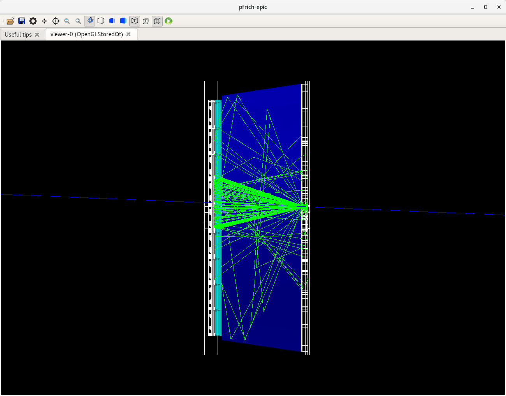
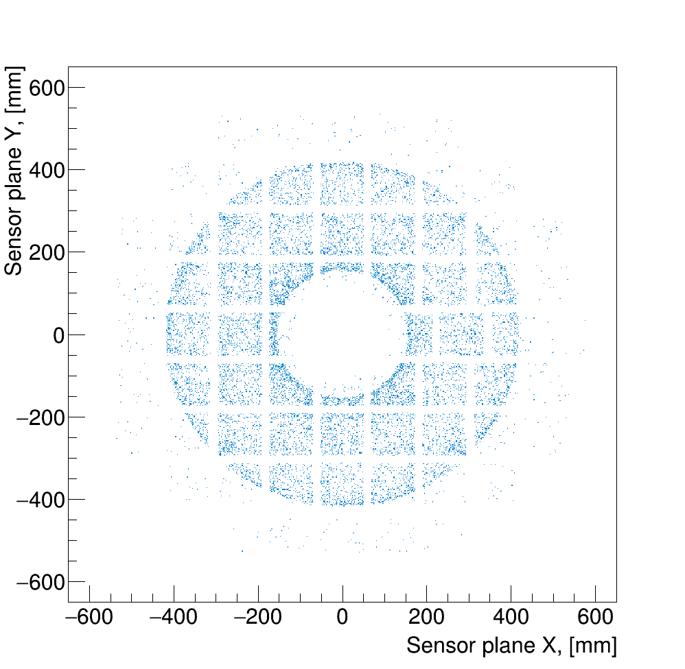
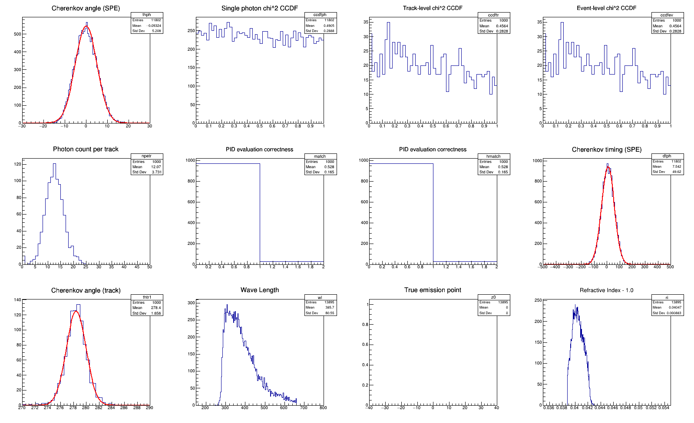

pfRICH
======

Standalone ePIC pfRICH GEANT4 simulation codes

 Content:

 * [Introduction](#introduction)
 * [Prerequisites and basic installation](#prerequisites-and-basic-installation)
 * [Pre-installed example](#pre-installed-example)
 * [Full installation](#full-installation)
 * [Example scripts](#example-scripts)
 * [Environment customization](#environment-customization)

Introduction
------------

  These codes were originally written for the ATHENA EIC detector proposal proximity focusing
Ring Imaging CHerenkov detector (pfRICH) in Fall 
2021. Later on they were adapted for a standalone simulation of ePIC pfRICH, as well as 
interfaced to the latest (2.0) version if [IRT libraries](https://github.com/eic/irt). 

  The codes contain a complete ePIC pfRICH detector geometry description, including its IRT-style
optics representation as a sequence of refractive and reflective boundaries between photon 
emisson and detection points. A custom [GEANT stepping function](g4irt/source/CherenkovSteppingAction.cc)
allows one to fully record history of Cherenkov photon creation and propagation through
the optical media, as well as keeps track of the daughter-parent relashionships between 
charged particles and produced optical photons, association between emission vertices and 
particular Cherenkov light radiators, etc.

  As of February 2024, the source code is split into four partss: one related to a 
[complete ePIC pfRICH detector](epic) simulation, one for a 
[pfRICH mockup](ftbf) simulation for the 2024 Fermilab beam test, one for a BNL HRPPD 
[test stand](tstand), and a part which is [common](share) for all three different geometries. 

<br/>

Prerequisites and basic installation
------------------------------------

  It is assumed that a user is familiar with ROOT and GEANT, as well as with the basic
concepts of Monte-Carlo simulations, Cherenkov ring imaging detector design and event 
reconstruction goals, as well as the basic principles of Ring Imaging CHerenkov (RICH) 
particle identification (PID) techniques.

  It is assumed that ROOT and GEANT are installed on a host PC, where the codes are supposed to be 
installed, as well as that *thisroot.sh* and *geant4.sh* were sourced already. GEANT is 
not needed to just import already produced ROOT trees.

  In the following the installation under /tmp/sandbox is assumed. Define SANDBOX 
environment variable accordingly if installing in a different directory. 

  Make sure 'cmake' is version 3.0 or higher. 

  The following combination is known to work: SL7, gcc 4.8.5, cmake 3.22.1, ROOT 6.18.04, 
GEANT 4.10.05.p01 . 


```
#
# Define installation area
#
export SANDBOX=/tmp/sandbox
export LD_LIBRARY_PATH=${SANDBOX}/lib:${SANDBOX}/lib64:${LD_LIBRARY_PATH}
```

```
#
# Install IRT library
#
cd ${SANDBOX}

git clone -b pfrich https://github.com/eic/irt.git
cd irt && mkdir build && cd build
cmake -DCMAKE_INSTALL_PREFIX=${SANDBOX} -Wno-dev ..
make -j8 install
```

```
#
# Download pfRICH repository
#
cd ${SANDBOX}

git clone https://github.com/alexander-kiselev/pfRICH.git
```

This is sufficient to import and analyze ROOT trees already produced after pfRICH 
GEANT simulation pass elsewhere (as long as there were no drastic changes to the 
C++ class variable description):

<br/>

Pre-installed example 
---------------------

```
#  TODO: NEED TO UPLOAD NEW ONES
#cd ${SANDBOX}/pfRICH
# A pre-uploaded file with 500 events;
#root -l './examples/pfrich.C("examples/pfrich.root")'
#root -l './examples/multi-eval.C("examples/pfrich.root")'
```

<br/>

Full installation
-----------------

Installation of the actual GEANT simulation environment requires few more steps (make sure 
*geant.sh* was sourced!):


```
#
# Install Xerces; YES, DO THIS EVEN IF YOU HAVE A SYSTEM ONE INSTALLED ALREADY
#
cd ${SANDBOX} 

# Copy over xerces-c-3.2.4.tar.gz (or a similar version) from the Web, unpack;
cd xerces-c-3.2.4 && mkdir build && cd build
cmake -DCMAKE_INSTALL_PREFIX=${SANDBOX} -Wno-dev ..
make -j8 install
```


```
#
# Install BeastMagneticField (optional, only needed for a full ePIC pfRICH simulation);
#
cd ${SANDBOX} 

git clone https://github.com/eic/BeastMagneticField.git
cd BeastMagneticField && mkdir build && cd build
cmake -DCMAKE_INSTALL_PREFIX=${SANDBOX} -Wno-dev ..
make -j8 install
```


```
#
# Install HepMC3 (optional, only needed for a full ePIC pfRICH simulation);
#
cd ${SANDBOX}

git clone https://gitlab.cern.ch/hepmc/HepMC3.git
cd HepMC3 && mkdir build && cd build
cmake -DCMAKE_INSTALL_PREFIX=${SANDBOX} -DHEPMC3_ENABLE_ROOTIO=ON -DHEPMC3_ENABLE_PYTHON=OFF ..
make -j8 install
```


```
#
# Install pfRICH simulation codes themselves
#
cd ${SANDBOX}/pfRICH

# Create links to the default header files; 
pushd share/include  && ln -s hrppd.default.h  hrppd.h && ln -s share.default.h share.h && popd
pushd epic/include   && ln -s epic.default.h   epic.h && popd
pushd ftbf/include   && ln -s ftbf.default.h   ftbf.h && popd
pushd tstand/include && ln -s tstand.default.h tstand.h && popd

mkdir build && cd build
# 'BMF' and 'HepMC3' are optional;
cmake -DCMAKE_INSTALL_PREFIX=${SANDBOX} -DIRT=${SANDBOX} -DBMF=${SANDBOX} -DHEPMC3=${SANDBOX} -DXERCES=${SANDBOX} -Wno-dev ..

make -j8 install
```

Example scripts 
---------------

```
#
# A full ePIC pfRICH detector
#
cd ${SANDBOX}/pfRICH
# FIXME: may need to click on "Useful tips", then on "viewer-0" in a Qt display;
./build/pfrich-epic -m macro/vis-epic.mac
```

A GEANT Qt display will appear with a picture similar to the image below. It would not hurt to add a bit 
of functionality to this display (like a "Next event button"). Feel free to contribute. 
 



```
# Generate a file *pfrich-epic.root* with 1000 events
./build/pfrich-epic -o pfrich-epic.root -s 1000

# See a hit map in the sensor plane;
root -l 'scripts/hit-map-epic.C("pfrich-epic.root")'
```



Consider to uncomment *#define __PRIMARY_PARTICLE_PHI__* in [epic/include/epic.default.h](epic/include/epic.default.h), 
recompile and rerun both commands, in order to see a clear ring. 

```
# Run IRT reconstruction; 
root -l 'scripts/reco-epic.C("pfrich-epic.root")'
```



#
# A Fermilab mockup of a pfRICH detector
#
./build/pfrich-ftbf -m macro/vis-ftbf.mac

# Will take quite some time because of the optical photon tracing in the lens radiator;
./build/pfrich-ftbf -o pfrich-ftbf.root -s 1000

root -l 'scripts/hit-map-ftbf-1x1.C("pfrich-ftbf.root")'
root -l 'scripts/hit-map-ftbf-2x2.C("pfrich-ftbf.root")'

# This one is also time consuming; comment "#define _ZCOORD_ASPHERIC_LENS_" in ftbf.default.h", 
# recompile and re-run ./build/pfrich-ftbf if the lens is of no interest;
root -l 'scripts/reco-ftbf.C("pfrich-ftbf.root")'
```

Environment customization
-------------------------

The code should be started in a *${SANDBOX}/pfRICH* directory, or otherwise in any other one, 
where exists a link to a *database* subdirectory, which contains MARCO solenoid field map (may be 
obsolete!), some of the media refractive index tables, etc. 

Per design, there are no other configuration files, either ASCII or XML ones, in this package.
All of the configuration changes are made through editing C++ header files and recompiling the 
executable codes. The rationale behind this paradigm is to have as transparent environment as
possible, where there is no convoluted path from e.g. changing the detector geometry and propagating 
this change to the actual simulation pass. Besides this, the optical description of a setup is 
saved in the output ROOT tree with the charged particle, optical photon information and hits, to simplify 
book-keeping (there is no way a reconstruction code can pick up an optical configuration which is
inconsistent with the GEANT geometry used in this simulation pass). All in all, it is a *development*
style package, limited in its functionality, and designed just to do the job of implementing and 
trying out changes in the detector geometry in as simple and efficient way as possible, rather than a 
versatile solid framework with a detector configuration being changed on a time scale of weeks and 
months. 

One downside of this approach is a necessity to keep track of *your own changes* and do not let them 
interfere (after a *pull* request) with other changes occasionally happening in the repository. There are 
presently five "default" C++ header files in the repository: one with an 
[HRPPD description](share/include/hrppd.default.h), one with [shared parameters](share/include/share.default.h), 
and one for each of the [epic](epic/include/epic.default.h), [Fermilab](ftbf/include/ftbf.default.h) and 
BNL [QA station](tstand/include/tstand.default.h) configurations.


```
# Consider creating your local copies of the repository header files, which you may want to change,
# and pointing links like share.h to them, like (for a person 'xx'):
cd ${SANDBOX}/pfRICH

pushd epic/include && rm epic.h && cp epic.default.h epic.xx.h && ln -s epic.xx.h epic.h && popd

# Then you can edit epic.xx.h locally without being affected by possible changes in epic.default.h
# which would overwrite your local changes after next pull
```

Feel free to store your private header files in the repository (ask for a write access if you do not have one),
and push them to the repository often enough. One can of course just create a git branch where one can modify 
the default header files directly.

It may make sense to look through the above mentioned default header files, which have a certain amount of 
comments, which allow one to understand what is what. It makes sense to periodically check whether anything 
was changed in the default configuration header files as compared to your local custom copies.

```
#Automation
#----------
#
#
# TODO: UPDATE THIS SECTION
#Inside pfRICH directory run
#`bash ./scripts/cc/AutomatedSimulationChain.sh`
#It will display all the features with an example.
#
```